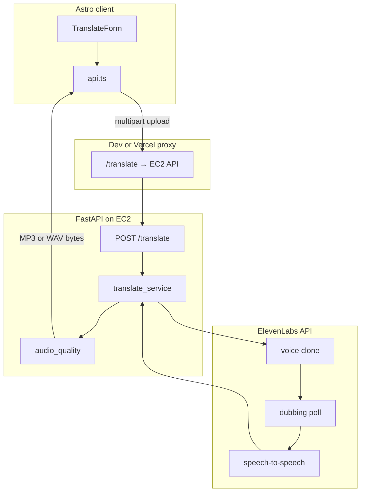

# Voice Translate

[CI/CD](https://github.com/ploymahloy/voice-translate/actions/workflows/ci.yml)

## Inspiration

This is a personal project to practice working with **Python**—building a FastAPI backend and integrating with the ElevenLabs API for voice cloning and dubbing. It also gave me a chance to practice building a CI/CD pipeline and **deploying to EC2**, running the API under systemd with a GitHub Actions self-hosted runner that auto-deploys on push to `master`.

## Tech stack

**Frontend** (`[client/](client/)`)

- Astro + TypeScript static site
- Deployed on Vercel; proxies `/translate` to the EC2 API (`[client/vercel.json](client/vercel.json)`)

**Backend** (`[server/](server/)`)

- Python 3.10+ with FastAPI and Uvicorn
- httpx for ElevenLabs; mutagen for audio quality checks

**Shared / external**

- `[shared/languages.json](shared/languages.json)` — ISO 639-3 language list used by both client and server
- [ElevenLabs API](https://elevenlabs.io) — voice clone, dubbing, speech-to-speech

## How it works

The browser form in `[client/src/components/translate/TranslateForm.astro](client/src/components/translate/TranslateForm.astro)` uploads audio via `[client/src/lib/api.ts](client/src/lib/api.ts)`. The FastAPI route in `[server/main.py](server/main.py)` delegates to `[server/services/translate_service.py](server/services/translate_service.py)`, which orchestrates ElevenLabs calls in `[server/ai.py](server/ai.py)` before returning validated audio.

## Testing strategy

Tests are layered by scope. CI runs unit and type checks only; integration tests against the real ElevenLabs API are manual because they use API quota. See [Verifying the installation](#verifying-the-installation) for copy-paste commands.

| Layer                    | What                                                        | CI                                                           |
| ------------------------ | ----------------------------------------------------------- | ------------------------------------------------------------ |
| **Server unit**          | FastAPI routes, validation, mocked ElevenLabs orchestration | Yes — `[.github/workflows/ci.yml](.github/workflows/ci.yml)` |
| **Server types**         | Static analysis                                             | Yes                                                          |
| **Client unit**          | API URL building, error handling, constants                 | Yes                                                          |
| **Client types + build** | Astro check + production build                              | Yes                                                          |
| **Integration**          | Real ElevenLabs E2E (`@pytest.mark.integration`)            | No — manual, uses API quota                                  |

CI jobs are **path-filtered** (server vs client changes). `make check` in `[server/Makefile](server/Makefile)` runs the full local gate: server tests, typecheck, client tests, and client check. There are no browser E2E tests (Playwright/Cypress)—coverage is unit tests and mocked API tests only.

Turn spoken audio into another language while keeping the speaker’s voice. Upload a recording, choose a target language, and receive translated speech that sounds like the original speaker.

This service runs locally (or on your own server) and uses [ElevenLabs](https://elevenlabs.io) for voice cloning, dubbing, and speech synthesis. You need an ElevenLabs API key with access to voice cloning and dubbing.

### Target languages

`target_language` must be an **ISO 639-3** code. The canonical list lives in `[shared/languages.json](shared/languages.json)`; the web UI shows the same languages sorted alphabetically by code.

**Accepted languages (74):**

| Code  | Language           | Code  | Language      | Code  | Language  |
| ----- | ------------------ | ----- | ------------- | ----- | --------- |
| `afr` | Afrikaans          | `ara` | Arabic        | `asm` | Assamese  |
| `aze` | Azerbaijani        | `bel` | Belarusian    | `ben` | Bengali   |
| `bos` | Bosnian            | `bul` | Bulgarian     | `cat` | Catalan   |
| `ceb` | Cebuano            | `ces` | Czech         | `cym` | Welsh     |
| `dan` | Danish             | `deu` | German        | `ell` | Greek     |
| `eng` | English            | `est` | Estonian      | `fil` | Filipino  |
| `fin` | Finnish            | `fra` | French        | `gle` | Irish     |
| `glg` | Galician           | `guj` | Gujarati      | `hau` | Hausa     |
| `heb` | Hebrew             | `hin` | Hindi         | `hrv` | Croatian  |
| `hye` | Armenian           | `ind` | Indonesian    | `isl` | Icelandic |
| `ita` | Italian            | `jav` | Javanese      | `kan` | Kannada   |
| `kat` | Georgian           | `kaz` | Kazakh        | `kir` | Kyrgyz    |
| `kor` | Korean             | `lav` | Latvian       | `lin` | Lingala   |
| `lit` | Lithuanian         | `ltz` | Luxembourgish | `mal` | Malayalam |
| `mar` | Marathi            | `msa` | Malay         | `nep` | Nepali    |
| `nld` | Dutch              | `nor` | Norwegian     | `nya` | Chichewa  |
| `ori` | Odia               | `pan` | Punjabi       | `pol` | Polish    |
| `por` | Portuguese         | `pus` | Pashto        | `ron` | Romanian  |
| `rus` | Russian            | `slk` | Slovak        | `slv` | Slovenian |
| `som` | Somali             | `spa` | Spanish       | `srp` | Serbian   |
| `swe` | Swedish            | `swa` | Swahili       | `tam` | Tamil     |
| `tel` | Telugu             | `tgl` | Tagalog       | `tha` | Thai      |
| `tur` | Turkish            | `ukr` | Ukrainian     | `urd` | Urdu      |
| `vie` | Vietnamese         | `yor` | Yoruba        | `yue` | Cantonese |
| `zho` | Chinese (Mandarin) | `zul` | Zulu          |       |           |

**Breaking change:** older 2-letter codes are no longer accepted. Migrate as follows:

| Old (ISO 639-1) | New (ISO 639-3) |
| --------------- | --------------- |
| `en`            | `eng`           |
| `es`            | `spa`           |
| `fr`            | `fra`           |
| `de`            | `deu`           |

**Input formats:** `.wav`, `.mp3`

**Response:** Translated audio as MP3 or WAV, depending on what the pipeline returns. The `Content-Type` header reflects the format.

**Source language:** Detected automatically; you only specify the target language.

## API overview

| Endpoint     | Method | Purpose                                    |
| ------------ | ------ | ------------------------------------------ |
| `/`          | GET    | Service info and links                     |
| `/health`    | GET    | Liveness check (`{"status":"ok"}`)         |
| `/ready`     | GET    | Readiness check (API key configured)       |
| `/translate` | POST   | Upload audio and receive translation       |
| `/docs`      | GET    | Interactive API documentation (Swagger UI) |

### Common errors

| Status | Meaning                                                      |
| ------ | ------------------------------------------------------------ |
| 400    | Missing file, empty file, or invalid upload                  |
| 401    | Missing or invalid `X-API-Key` when `SERVICE_API_KEY` is set |
| 413    | Upload exceeds `MAX_UPLOAD_BYTES`                            |
| 415    | Unsupported audio format                                     |
| 422    | Invalid `target_language`                                    |
| 502    | Translation output failed quality validation                 |
| 503    | ElevenLabs timeout or configuration/auth problem             |
| 500    | Unexpected failure during translation                        |

Error bodies include a `detail` message you can show to users or logs.

## How long does it take?

Translation is not instant. The service clones a voice profile from your upload, runs dubbing, applies the cloned voice to the dubbed audio, and may normalize output length. ElevenLabs dubbing is polled until complete (up to about 90 seconds). Plan for **roughly 30–90 seconds** per request for typical clips; longer source audio can take more time and consume more API quota.

## Privacy and data handling

- Uploaded audio is written to a temporary file on the server for processing, then deleted.
- A short-lived voice profile is created on ElevenLabs for your clip and **deleted after each request** when possible.
- Audio and API traffic go to ElevenLabs under your account; review their terms and data policies before production use.

## License and third-party services

Translation quality, availability, and billing depend on ElevenLabs. This application is a thin wrapper around their voice clone, dubbing, and speech-to-speech APIs; usage counts against your ElevenLabs account.
